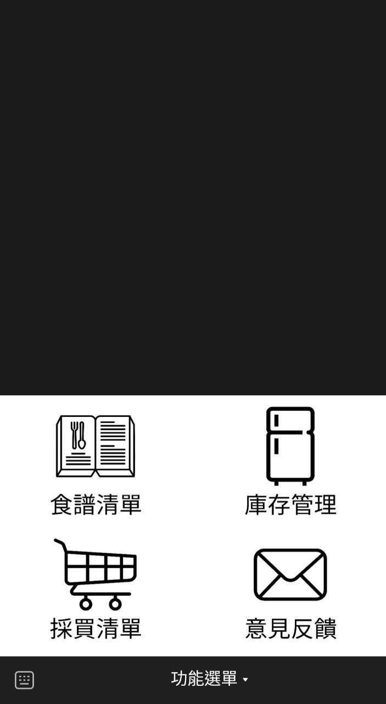
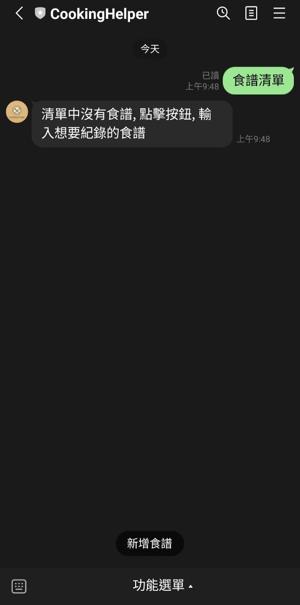
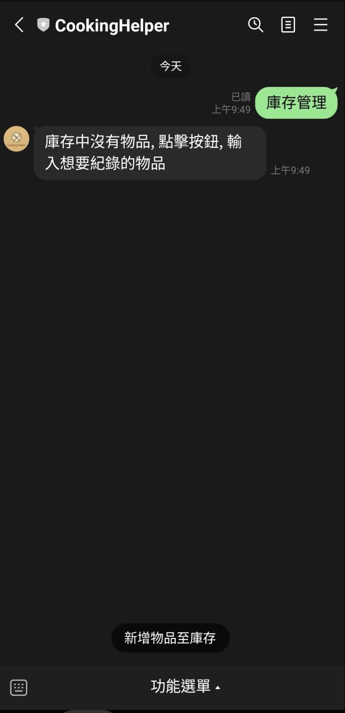
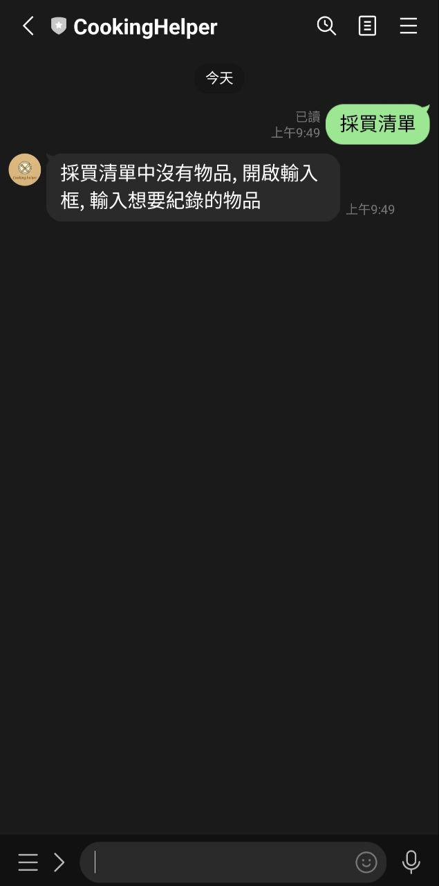
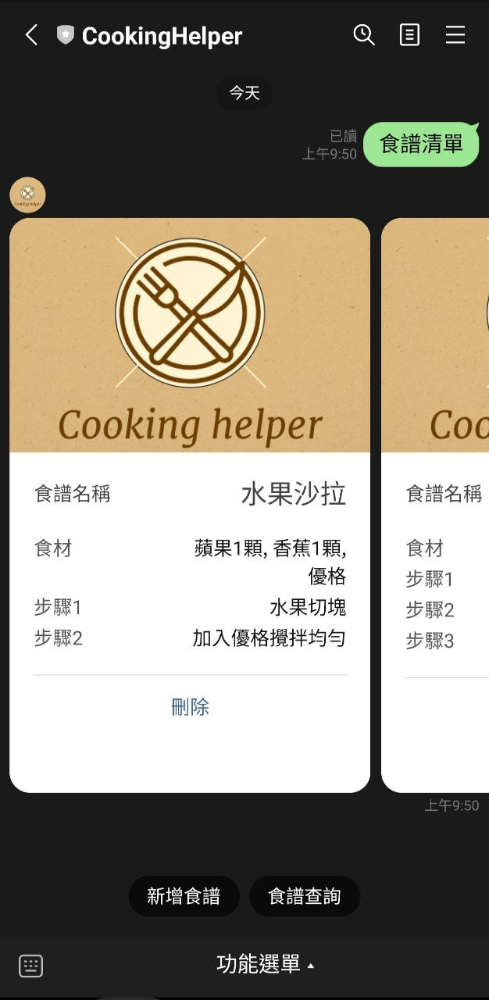
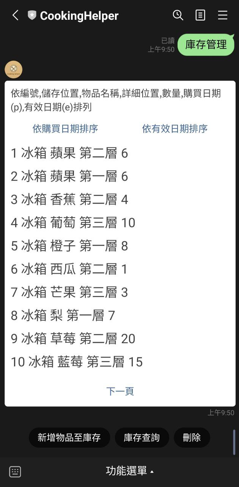
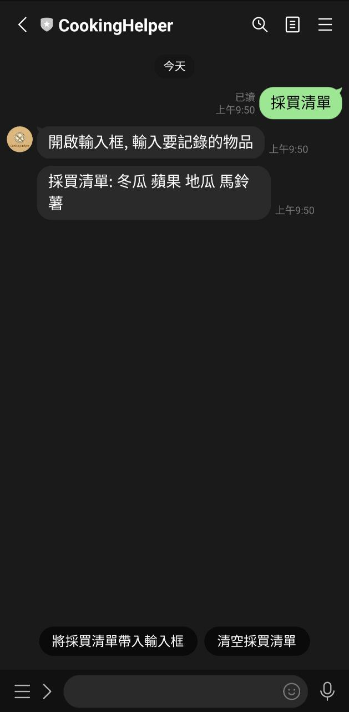

# CookingHelper
這個專案是幫助料理的工具, 透過 Line bot建立機器人並與其互動達到紀錄庫存,食譜,購買清單的功能. 另外有後台系統可以查看 Line bot的使用狀況.

## 目錄
- [範例](#範例)
- [功能展示](#功能展示)

### 範例
**LineBot連結**: [https://line.me/R/ti/p/@438nxdys](https://line.me/R/ti/p/@438nxdys)  
> LintBot 沒有新增資料可以透過輸入 /data 產生假資料>

**後台連結**: [https://cookinghelper.azurewebsites.net/](https://cookinghelper.azurewebsites.net/)
> 管理者帳號:
> 帳號: cookinghelper@gmail.com
> 密碼: cookinghelper  
> 一般用戶帳號:
> 帳號: guest@gmail.com
> 密碼: guest01

### 功能展示
#### LintBot 使用介面

  

透過點擊食譜清單,庫存管理,採買清單並依據提示,輸入文字或執行特定按鈕完成互動
 
 

| 食譜清單  | 庫存管理 | 採買清單|
| ------------- | ------------- | -------------|
| 沒有資料 | 沒有資料 | 沒有資料 |
|   |    |    |
| 有資料  |有資料  | 有資料  |
|    |    |   |

#### 後台連結
系統分析

帳號管理

